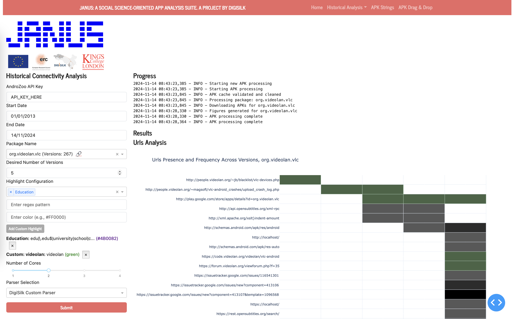

# JANUS UI
# See APK endpoints evolution over time




This Dash web app allows you to analyse a chronological series of APK files, extract subdomains, domains, and URLs, and visualise their presence across different versions of Android apps. It uses the AndroZoo research dataset and several Python libraries (such as Androguard) to download, process, and visualise the data.

If you are not familiar with git or running python code, we will soon add additional guidance.

## Features

- Download a chronological sequence of APK files from AndroZoo for a given date range.
- Extract subdomains, domains, and URLs from APK files
- Analyze and visualise the extracted data
- Provide heatmaps and grouped bar charts for the extracted data

## Prerequisites

Ensure you have met the following requirements:

- Python 3.7 or higher
- Access to the AndroZoo dataset (API key required)

## Installation

1. **Clone the repository:**
```
   git clone https://github.com/digisilk/janus_ui.git
   cd janus_beginner
```
2. **Create a virtual environment:**
```
   python3 -m venv venv
   source venv/bin/activate  # On Windows use `venv\Scripts\activate`
```
3. **Install the required dependencies:**
```
   pip install -r requirements.txt
```
## Configuration

### API Key:

Obtain an API key from AndroZoo (https://androzoo.uni.lu). Set the API key in the index.html form if you wish it to be used by default.

### CSV File:

Ensure the AndroZoo database (latest_with-added-date.csv file) from AndroZoo is available in the project directory. The script will download and extract this file if it does not exist.

## Running the App

### Start the Dash application:
```
   python index.py
```
### Access the application:

Open your web browser and go to http://127.0.0.1:5000.

## Usage

### Enter the required details:

- API key
- Package name
- Start date (YYYY-MM-DD)
- End date (YYYY-MM-DD)

### Submit the form:

- Click on the 'Submit' button

### Download the results:
Graphs will display in the UI, and a link to download the results as a HTML files is also provided.

## Dependencies

```
- Flask
- Pandas
- Plotly
- Requests
- Androguard
- tldextract
- tqdm
```

## Contributing

Contributions are welcome! Please feel free to submit a Pull Request.

## License

License to be confirmed.

## Acknowledgements

- AndroZoo for providing the dataset.
- Androguard for the reverse engineering framework.
- Plotly for data visualisation and Dash framework.
